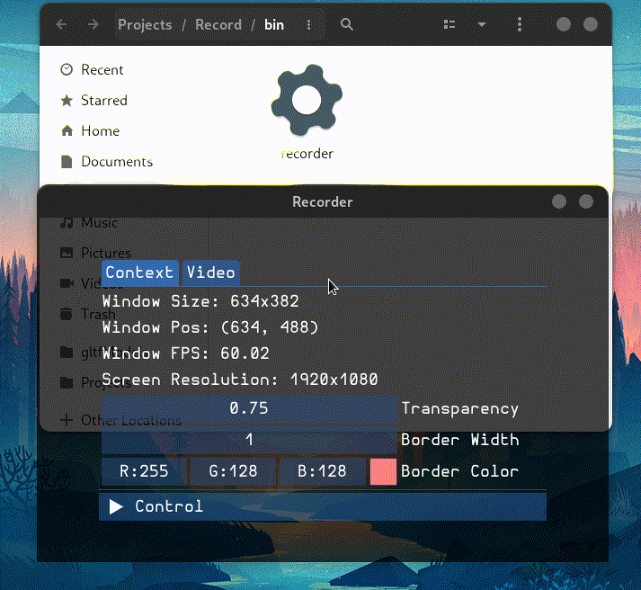

# Record


A cross-platform screen capture application that is able to record a user-defined area on screen.  
On Linux there is an awesome screen capture application ([Peek](https://github.com/phw/peek)) but on Windows I cannot find anything. That's why this project is created.  

------

## Controls

* `ESC`: exit app  
* `F11`: toggle fullscreen  
* `CTRL` + Global Hotkey: start/stop recording  

__Global Hotkey__:  
The program will select from (`F10`, `F9`, `F8`, `F7`, `F6`) or raise error if none can be registered. See `Control` on app UI for details (`F10` is the default).  
At most 5 instance of this application can be launched at the same time!

## Platform  

Current supported platforms are:  
* Linux (X11 backend)  
* Windows  

Right now capturing on secondary monitors is not supported yet.

## Feature Plans

- [x] Global Hotkey for Window Re-focus  
- [x] Windows Platform Support  
- [x] Fullscreen Capture  
- [x] App Icon  
- [x] Media File Multi-Access Protection  
- [x] Better UI Fonts (Hurmit Font)  
- [ ] Audio Capture  
- [ ] Microphone Support  
- [ ] Video Formats:  
    - [x] mp4  
    - [ ] mkv  
    - [x] gif  
    - [x] mov  
    - [x] wmv  
    - [ ] webm  
    - [x] flv  
    - [x] avi  
    - [x] apng  
- [ ] Multi-monitor Support  

## Demo

A classic "record myself recording":  
  
This GIF is further compressed by ImageMagick after recording.  
But apparently GIFs have bad quality compared to other video formats.  

## Dependencies

* [ImGui](https://github.com/ocornut/imgui)  
* [GLFW 3.4](https://github.com/glfw/glfw)  
* [GLEW](http://glew.sourceforge.net/)  
* [FFmpeg 5.0 Libav](https://github.com/FFmpeg/FFmpeg)  
* [termcolor](https://github.com/ikalnytskyi/termcolor)  

<details>
<summary>Windows Additional Libs</summary>

The following libs are required for Windows static build, but should all exist in a standard Windows environment:  
* comdlg32.lib  
* mfplat.lib  
* mfuuid.lib  
* strmiids.lib  
* secur32.lib  
* shlwapi.lib  
* vfw32.lib  
* ws2_32.lib  
* bcrypt.lib  

</details>

## Compilation

First pull the repo and run:
```bash
git submodule update --init --recursive
```

<details>
<summary>Steps for Linux</summary>

On linux, make sure `ffmpeg` (version 5.0) and related `libav` libraries are installed. If you are not sure:
```bash
ldconfig -p | grep libav
ldconfig -p | grep libsw
```
and look for the following libraries:
* `libavdevice`  
* `libavfilter`  
* `libavformat`  
* `libavcodec`  
* `libswresample`  
* `libswscale`  
* `libavutil`  

If you are not using X11, run following:
```bash
export GDK_BACKEND=x11
```
to force x11 backend.

</details>

Then init build files:
```bash
mkdir build
cd build
cmake ..
```

Build (Linux):
```bash
make -j4
```

Build (Windows):
```powershell
cmake --build . --config Release
```

Executable is under `bin` folder

Note that on Windows it is a static build, while on Linux it is shared

------

## Releases

[Windows Builds](https://github.com/teamclouday/Record/releases)